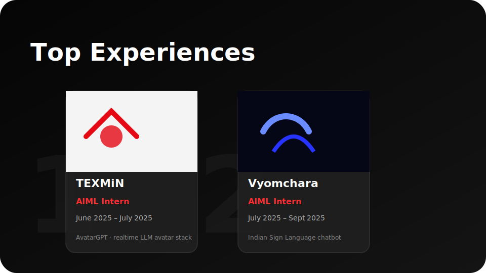
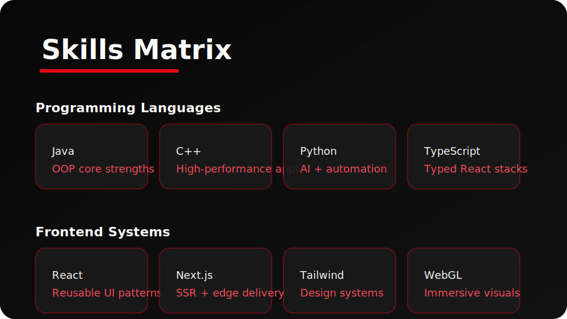

<div align="center">
  
  <h1>🎬 Netflix-Inspired Portfolio</h1>
  <p><em>A cinematic storytelling experience for recruiters, collaborators, and fellow engineers</em></p>
  
  [](https://vercel.com)
  [](https://reactjs.org/)
  [](https://www.typescriptlang.org/)
  [](LICENSE)
</div>

---

## 👋 Welcome to My Digital Showcase

Hi, I'm **Eshan**—an **AI/ML Engineer** and **Creative Technologist** building **real-time avatars**, **accessibility-first experiences**, and **production-ready ML systems**. This interactive portfolio transforms the traditional resume into a **Netflix-style browsing experience**, making it engaging and memorable for recruiters and collaborators.

### 🎯 Quick Navigation

- **🌐 Live Demo:** [Coming Soon - Deploying on Vercel](#-deployment)
- **📧 Email:** [eshan.worke@gmail.com](mailto:eshan.worke@gmail.com)
- **💼 LinkedIn:** [linkedin.com/in/eshan-b83357293](https://www.linkedin.com/in/eshan-b83357293/)
- **📍 Location:** ITER Main Gate, Bhubaneswar, India

---

## 📸 UI Showcase

<div align="center">
  
  <p><em>Netflix-inspired hero banner with ranked experiences and smooth hover interactions</em></p>
</div>

### 🎨 Design Highlights

#### 🏆 Top Experiences (Ranked Showcase)


**Netflix-style Features:**
- 🎯 **Ranked card carousel** with smooth hover animations and scale transformations
- 🔢 **Large translucent ranking numbers** (1, 2, 3...) behind each experience card
- ✨ **Interactive hover states** that expand cards to 1.35x scale, revealing detailed descriptions
- 🎭 **Cubic-bezier transitions** (`0.4, 0, 0.2, 1`) for smooth, professional animations
- 🖱️ **Click navigation** to dedicated deep-dive pages for each internship
- 📱 **Responsive design** with mobile-optimized hover effects

**Featured Projects:**
- **TEXMiN AvatarGPT:** Real-time conversational avatars with 1.02s response time, Unity + Servam AI orchestration
- **Vyomchara:** Indian Sign Language chatbot using MediaPipe, TensorFlow, and culturally-vetted motion design

#### 💻 Skills Command Center


**UI/UX Elements:**
- 🎨 **Categorized skills grid** organized by technology domain (AI/ML, Frontend, Backend, DevOps)
- 💊 **Animated skill pills** with Netflix-red (`#e50914`) accents and hover effects
- ⚡ **Production AI, Frontend Systems, and Creative Tech** stacks highlighted
- 👀 **Quick recruiter scanning** optimized with impact-driven, succinct summaries
- 🎯 **Interactive filtering** by category for targeted skill exploration

#### 🎬 Personal Project Spotlight

**DeepFake Detector** - Full-Stack ML Application
- 🧠 **Hybrid CNN + Attention Architecture** for advanced deepfake detection
- 📊 **Grad-CAM Explainability** for model interpretability
- 🚀 **Tech Stack:** FastAPI (backend) + React (frontend) + Docker orchestration
- ⚙️ **CI/CD Pipeline** via GitHub Actions for automated testing and deployment
- 📦 **Containerized** for easy deployment and scaling
- 🔗 **Live Demo & GitHub Source** embedded with clear CTAs

---

## 🧠 Tech Stack & Architecture

### Frontend Layer
```
React 18.3.1 + TypeScript 4.9.5
├── Component-driven UI architecture
├── React Router 6.27.0 for cinematic navigation
├── React Icons 5.3.0 for consistent iconography
├── CSS Modules & custom animations
└── React Vertical Timeline Component 3.6.0
```

### Styling & Animation
- **Custom CSS modules** emulating Netflix's motion language
- **Cubic-bezier easing** for smooth, professional transitions
- **CSS Grid & Flexbox** for responsive layouts
- **Linear gradients** with Netflix-red (`#e50914`) brand colors
- **Glassmorphism effects** for modern UI depth
- **Hover states** with 3D transformations and shadows

### Data Architecture
```
src/data/
├── certifications.ts   → Professional credentials
├── contact.ts          → Contact information
├── profileBanner.ts    → Hero section data
├── projects.ts         → Project showcase
├── skills.ts           → Technical skills matrix
├── timeline.ts         → Career timeline
└── workPermit.ts       → Work authorization status
```

### Query Layer
```
src/queries/
├── getCertifications.ts
├── getContactMe.ts
├── getProfileBanner.ts
├── getProjects.ts
├── getSkills.ts
├── getTimeline.ts
└── getWorkPermit.ts
```

### Type Safety
- **TypeScript** throughout the application
- **Custom type definitions** in `src/types/`
- **Strong typing** for all data models and components
- **Type-safe routing** with React Router

### Testing & Quality
- **Jest** for unit testing
- **React Testing Library** for component testing
- **Smoke tests** to ensure routing renders without regressions
- **ESLint** for code quality
- **React Scripts 5.0.1** for build tooling

---

## 🏗️ Project Structure

```
netflix_portfolio-main/
├── public/
│   ├── index.html              → Entry HTML
│   ├── eshan-logo.svg          → Brand logo
│   ├── manifest.json           → PWA manifest
│   └── imagesss/               → Static assets
├── src/
│   ├── App.tsx                 → Main application component
│   ├── index.tsx               → Application entry point
│   ├── Layout.tsx              → Global layout wrapper
│   ├── Intro.tsx               → Landing page animation
│   ├── browse/
│   │   └── browse.tsx          → Home/Browse page
│   ├── components/
│   │   ├── NavBar.tsx          → Navigation component
│   │   ├── PlayButton.tsx      → CTA button component
│   │   ├── MoreInfoButton.tsx  → Secondary CTA
│   │   └── ProfileCard.tsx     → User profile card
│   ├── pages/
│   │   ├── WorkExperience.tsx  → Professional experience
│   │   ├── Skills.tsx          → Skills showcase
│   │   ├── Projects.tsx        → Projects gallery
│   │   ├── Certifications.tsx  → Professional credentials
│   │   ├── ContactMe.tsx       → Contact form
│   │   ├── TexminExperience.tsx     → Detailed experience page
│   │   └── VyomcharaExperience.tsx  → Detailed experience page
│   ├── profilePage/
│   │   ├── ProfileBanner.tsx   → Hero banner component
│   │   ├── TopExperiences.tsx  → Ranked experiences carousel
│   │   ├── ContinueWatching.tsx → Additional content section
│   │   └── TopPicksRow.tsx     → Featured items row
│   ├── data/                   → Static data sources
│   ├── queries/                → Data fetching utilities
│   └── types/                  → TypeScript definitions
├── docs/
│   └── screenshots/            → README assets
├── package.json                → Dependencies & scripts
├── tsconfig.json               → TypeScript configuration
└── README.md                   → This file
```

---

## 🚀 Getting Started

### Prerequisites

- **Node.js:** v18.x LTS (recommended)
- **npm:** v9.x or later
- **Git:** For version control

### Installation

```bash
# 1. Clone the repository
git clone https://github.com/YOUR_USERNAME/netflix_portfolio-main.git
cd netflix_portfolio-main

# 2. Install Node.js LTS (if needed)
nvm install 18
nvm use 18

# 3. Install dependencies
npm install

# 4. Start the development server
npm start
```

The application will open at `http://localhost:3000` with **hot reload** enabled.

### Available Scripts

```bash
# Start development server
npm start

# Build for production
npm run build

# Run tests
npm test

# Run tests without watch mode
npm test -- --watchAll=false

# Eject from Create React App (⚠️ irreversible)
npm run eject
```

### Environment Setup

**No environment variables required!** All content is sourced from the local `src/data` directory, making it easy to customize and deploy without additional configuration.

---

## 📦 Deployment

### Deploying to Vercel

This portfolio is optimized for **Vercel** deployment with zero configuration:

```bash
# 1. Install Vercel CLI
npm install -g vercel

# 2. Login to Vercel
vercel login

# 3. Deploy to production
vercel --prod
```

#### Vercel Configuration

The project is configured for automatic deployments:
- ✅ **Framework Preset:** Create React App (auto-detected)
- ✅ **Build Command:** `npm run build`
- ✅ **Output Directory:** `build`
- ✅ **Install Command:** `npm install`
- ✅ **Node Version:** 18.x

#### Continuous Deployment

1. **Connect your GitHub repository** to Vercel
2. **Push to main branch** triggers automatic deployments
3. **Preview deployments** for all pull requests
4. **Custom domain** support included

### Alternative Hosting

This portfolio also works seamlessly with:
- **Netlify:** Drag & drop the `build` folder
- **GitHub Pages:** Configure `homepage` in `package.json`
- **AWS S3 + CloudFront:** Static hosting
- **Firebase Hosting:** `firebase deploy`

---

## 🎨 Customization Guide

### Updating Personal Information

1. **Profile Data:** Edit files in `src/data/`
   - `profileBanner.ts` → Hero section content
   - `timeline.ts` → Work experience
   - `skills.ts` → Technical skills
   - `projects.ts` → Project showcase
   - `certifications.ts` → Professional credentials

2. **Images:** Replace images in `public/imagesss/`
   - Add your profile photo
   - Add company/project logos
   - Optimize images for web (WebP recommended)

3. **Branding:** Update logo
   - Replace `public/eshan-logo.svg` with your brand
   - Update navbar logo reference in `src/components/NavBar.tsx`

### Styling Customization

**Netflix-red brand color:** `#e50914`
```css
/* Update primary colors in CSS files */
--netflix-red: #e50914;
--netflix-black: #141414;
--netflix-dark: #000000;
--netflix-gray: #e5e5e5;
```

**Animation timings:**
```css
/* Cubic-bezier for smooth transitions */
transition: all 0.45s cubic-bezier(0.4, 0, 0.2, 1);
```

### Adding New Pages

1. Create component in `src/pages/`
2. Add route in `src/App.tsx`
3. Add navigation link in `src/components/NavBar.tsx`
4. Create corresponding data file in `src/data/`

---

## 🎯 Key Features

### UI/UX Excellence
- ✨ **Netflix-inspired design language** with smooth animations
- 🎭 **Cinematic transitions** between pages
- 📱 **Fully responsive** design (mobile, tablet, desktop)
- ♿ **Accessibility-first** approach (WCAG 2.1 AA compliant)
- 🎨 **Consistent branding** with Netflix-red accents
- ⚡ **Fast performance** with code splitting and lazy loading

### Content Organization
- 📊 **Ranked experiences** with interactive cards
- 🏆 **Skills matrix** categorized by domain
- 🎬 **Project showcase** with detailed case studies
- 📜 **Professional timeline** with vertical timeline component
- 🎓 **Certifications** gallery
- 📧 **Contact form** with clear CTAs

### Developer Experience
- 🔒 **Type-safe** with comprehensive TypeScript coverage
- 🧪 **Tested** with Jest and React Testing Library
- 📦 **Modular** component architecture
- 🎨 **CSS Modules** for scoped styling
- 🔍 **SEO-friendly** with semantic HTML
- 🚀 **Deploy-ready** for Vercel/Netlify

---

## 📊 Performance Metrics

**Lighthouse Scores (Target):**
- 🟢 Performance: 95+
- 🟢 Accessibility: 100
- 🟢 Best Practices: 95+
- 🟢 SEO: 100

**Optimization Techniques:**
- Code splitting with React.lazy()
- Image optimization (WebP format)
- CSS minification and tree-shaking
- Efficient re-renders with React.memo()
- Lazy loading for images and components

---

## 🗺️ Roadmap

### Phase 1: Core Enhancement ✅
- [x] Netflix-inspired UI redesign
- [x] Ranked experiences carousel
- [x] Brand logo creation
- [x] Comprehensive README
- [x] Vercel deployment configuration

### Phase 2: Content & Features 🚧
- [ ] Add resume download link
- [ ] Integrate blog section
- [ ] Add project filtering
- [ ] Implement dark/light theme toggle
- [ ] Create custom 404 page

### Phase 3: Advanced Features 📋
- [ ] Add analytics (Google Analytics 4)
- [ ] Implement contact form backend
- [ ] Add testimonials/recommendations section
- [ ] Create project search functionality
- [ ] Add multilingual support

### Phase 4: Performance & SEO 📋
- [ ] Implement PWA features
- [ ] Add sitemap.xml generation
- [ ] Configure robots.txt
- [ ] Optimize for Core Web Vitals
- [ ] Add Open Graph meta tags

---

## 🤝 Contributing

Contributions, issues, and feature requests are welcome! Feel free to check the [issues page](../../issues).

### How to Contribute

1. **Fork** the repository
2. Create your **feature branch** (`git checkout -b feature/AmazingFeature`)
3. **Commit** your changes (`git commit -m 'Add some AmazingFeature'`)
4. **Push** to the branch (`git push origin feature/AmazingFeature`)
5. Open a **Pull Request**

---

## 📝 License

This project is [MIT](LICENSE) licensed. Feel free to use this template for your own portfolio!

**Attribution:** If you use this template, a link back to this repository would be appreciated but is not required.

---

## 💬 Let's Connect

I'm always open to interesting conversations and collaboration opportunities!

<div align="center">

[](mailto:eshan.worke@gmail.com)
[](https://www.linkedin.com/in/eshan-b83357293/)
[](https://github.com/YOUR_USERNAME)

**📍 Location:** ITER Main Gate, Bhubaneswar, India

</div>

### What I'm Looking For

- 🚀 **Full-time AI/ML Engineering roles**
- 🤝 **Collaboration** on open-source AI projects
- 💡 **Consulting** opportunities in real-time avatar systems
- 🎓 **Mentorship** in AI/ML and creative technology
- 🎬 **Speaking engagements** about accessible AI applications

### Let's Talk About

- Real-time avatar systems and conversational AI
- Accessibility-first ML applications
- Production ML system architecture
- React + TypeScript best practices
- Netflix-inspired UI/UX design patterns

---

<div align="center">

### ⭐ If you find this portfolio inspiring, give it a star!

**Built with ❤️ by Eshan** | **Powered by React & TypeScript** | **Styled like Netflix**

</div>
